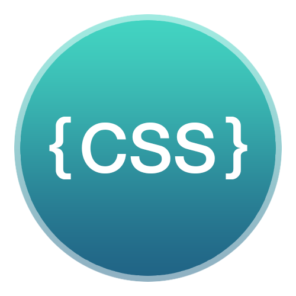

<div style="text-align: center;">
    
</div>

# CSS Preview

## Description
CSS Preview enables you to see a visual representation of your styled selectors without leaving your editor.

## Preview


## How to use?
* Open a .css file
* Press CMD+Shift+P (macOS) or Ctrl+Shift+P (Windows)
* Run the CSS Preview command (this opens a preview window)
* Enjoy writing selectors with live preview! <3

## Features
### --text property
```css
.example {
    --text: "Write markup or simple text to preview inside your element";
}
```

## Backlog
* .scss and .less file support (without preprocessing functionality)
* Gradient tool
* Color tool
* Font tool
* Share your ideas for new features...

## Release Notes

### 1.0.0
* Initial release of CSS Preview

### 1.0.1
* Updated README.md with better description of the extension.

## Social
Follow me on Twitter:

[@sandorengholm](https://twitter.com/sandorengholm)